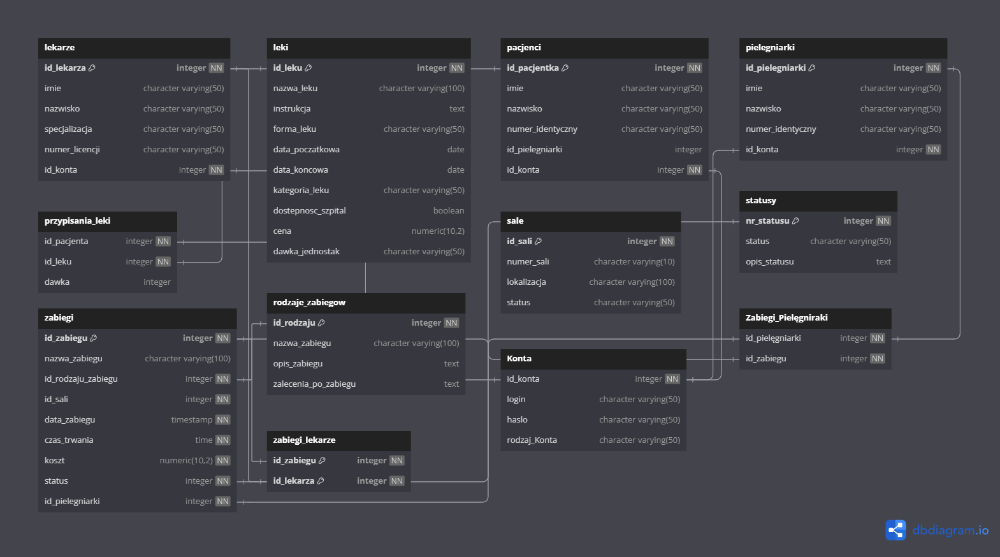

# Aplickacja Zarządzająca Szpitalem

## Autorzy: Michał Pilecki, Jakub Opar

### 1. Opis projektu
System zarządzania szpitalem to aplikacja internetowa zaprojektowana dla placówek medycznych, umożliwiająca zarządzanie pacjentami, lekarzami, pielęgniarkami, lekami oraz procedurami medycznymi tzn. dodawanie, usuwanie, modyfikowanie oraz wyświetlanie danych pacjentów, lekarzy, pielęgniarek, historii zabiegów pacjentów oraz kontroli stanu leków w magazynie.

Ponadto aplikacja będzie aktualizowała status sal i zabiegów w czasie rzeczywistym, wyświetlała powiadomienia o zbliżającym się terminie zabiegu i w momencie, gdy będzie niewielka ilość danego leku na stanie. 
Baza danych będzie zabezpieczona pod kątem błędnych operacji np. Odbycie się zabiegu w Sali w której odbywa się już inny zabieg lub żeby pacjent nie miał dwóch zabiegów w tym samym czasie.
 
Lekarz będzie miał możliwość podglądu zaplanowanych zabiegów na dany termin, pielęgniarka dodatkowo będzie miała informacje jakimi pacjentami się zajmuje. 

Pacjent będzie miał możliwość wyświetlenia informacji na temat informacji o zabiegu, jego terminu oraz jakie ma się przypisane leki. 

### 2. Opis bazy danych

#### Rysunek 1. Diagram ERD bazy danych.
Rysunek 1. przedstawia schemat bazy danych szpitala. Składa się ona z dwunastu tabel, w tym dziewięciu tabel podstawowych i trzech łączących.

##### Informacje o tabelach
| Tabela "lekarze"         | Opis: Zawiera informacje o lekarzach        |
|--------------------------|---------------------------------------------|
| Id_lekarza               | Unikalny identyfikator lekarza              |
| Imię                     | Imię lekarza                                |
| Nazwisko                 | Nazwisko lekarza                            |
| Specjalizacja            | Specjalizacja lekarza                       |
| Numer_licencji           | Numer licencji lekarza                      |
| Id_konta                 | Identyfikator konta przypisanego do lekarza|

| Tabela "leki"            | Opis:                                       |
|--------------------------|---------------------------------------------|
| Id_leku                  | Unikalny identyfikator leku                 |
| Nazwa_leku               | Nazwa leku                                  |
| Instrukcja               | Instrukcja dotycząca stosowania leku        |
| Forma_leku               | Forma leku (np. tabletki, syrop)            |
| Kategoria_leku           | Kategoria, do której należy lek (np. przeciwbólowy, antybiotyk)|
| Cena                     | Cena leku                                   |
| Dawka_jednostka          | Jednostka dawki leku (np. gramy, mililitry) |
| Ilość                    | Ilość leku w magazynie                      |

| Tabela "pacjenci"        | Opis:                                       |
|--------------------------|---------------------------------------------|
| Id_pacjenta              | Unikalny identyfikator pacjenta             |
| Imie                     | Imię pacjenta                               |
| Nazwisko                 | Nazwisko pacjenta                           |
| Id_pielegniarki          | Identyfikator pielęgniarki przypisanej do pacjenta |
| Id_konta                 | Identyfikator konta przypisanego do pacjenta |
| Czas_pobytu(DNI)         | Czas trwania pobytu pacjenta w dniach       |
| Id_Sali                  | Identyfikator sali, w której przebywa pacjent |

| Tabela "pielegniarki"    | Opis:                                       |
|--------------------------|---------------------------------------------|
| Id_pielengniarki         | Unikalny identyfikator pielęgniarki         |
| Imie                     | Imię pielęgniarki                           |
| Nazwisko                 | Nazwisko pielęgniarki                       |
| Numer_identyczny         | Numer identyfikacyjny pielęgniarki          |
| Id_konta                 | Identyfikator konta przypisanego do pielęgniarki |

| Tabela "przypisania_leki"| Opis: Tabela łącząca między pacjentami, a lekami przypisanymi do nich |
|--------------------------|---------------------------------------------|
| Id_pacjenta              | Identyfikator pacjenta                      |
| Id_leku                  | Identyfikator leku                          |
| Dawka                    | Dawka leku wyrażona w liczbie całkowitej. (Informacje o jednostce jest zawarta w tabeli leki) |
| Data_poczatkowa          | Data rozpoczęcia przyjmowania leku          |
| Data_koncowa             | Data zakończenia przyjmowania leku          |
| Data_waznosci            | Data ważności leku                          |
| Dostepnosc_szpital       | Dostępność leku w szpitalu                 |

| Tabela "rodzaje_zabiegow"| Opis: Tabela zawierająca informacje o rodzajach zabiegów i zaleceniach przed i po nim |
|--------------------------|---------------------------------------------|
| Id-rodzaju               | Unikalny identyfikator rodzaju zabiegu      |
| Nazwa_zabiegu            | Nazwa zabiegu                               |
| Opis_zabiegu             | Opis zabiegu                                |
| Zalecenia_przed_zabiegiem| Zalecenia przed zabiegiem                   |
| Zalecenia_po_zabiegu     | Zalecenia po zabiegu                        |

| Tabela "sale"            | Opis: Tabela zawierająca informacje o salach i ich statusie |
|--------------------------|---------------------------------------------|
| Id_sali                  | Unikalny identyfikator sali                 |
| Numer_sali               | Numer sali                                  |
| Lokalizacja              | Lokalizacja Sali w budynku                  |
| Status sali              | Status Sali                                 |
| Typ_sali                 | Typ Sali (np. Operacyjna)                   |
| Miejsca                  | Ilość łóżek w sali                          |

| Tabela "statusy"         | Opis: Tabela zawierająca informacje o znaczeniu danego statusu |
|--------------------------|---------------------------------------------|
| Nr_statusu               | Numer statusu                               |
| Status                   | Nazwa statusu                               |
| Opis statusu             | Opis statusu                                |

| Tabela "zabiegi"         | Opis: Tabela zawierająca informacje o zabiegach, ich terminach, kosztach oraz ich statusie |
|--------------------------|---------------------------------------------|
| Id_zabiegu               | Unikalny identyfikator zabiegu              |
| Id_rodzaju_zabiegu       | Identyfikator rodzaju zabiegu              |
| Id_Sali                  | Identyfikator sali, w której odbywa się zabieg |
| Data_zabiegu             | Data kiedy odbywa się zabieg               |
| Czas_trwania             | Czas trwania zabiegu                        |
| Koszt                    | Koszt zabiegu                               |
| Status                   | Status zabiegu                              |

| Tabela "zabiegi_lekarze" | Opis: Tabela łącząca między zabiegami, a lekarzami |
|--------------------------|---------------------------------------------|
| Id_zabiegu               | Identyfikator zabiegu                       |
| Id_lekarza               | Identyfikator lekarza                       |

| Tabela "Konta"           | Opis: Tabela zawierająca informacje o kontach |
|--------------------------|---------------------------------------------|
| Id_konta                 | Unikalny identyfikator konta                |
| Login                    | Login konta                                 |
| Hasło                    | Hasło konta
| Rodzaj_Konta             | Rodzaj konta. Każdy z rodzajów ma inne uprawnienia. |

| Tabela "Zabiegi_Pielęgniarki" | Opis: Tabela łącząca między zabiegami, a pielęgniarkami |
|--------------------------|---------------------------------------------|
| Id_pielegniarki          | Identyfikator pielęgniarki                 |
| Id_zabiegu               | Identyfikator zabiegu                      |

#### Uwagi:
| W tabeli konta istnieje konto administratora o id 1 które nie jest przypisane do żadnej tabeli. |
|---------------------------------------------------------------------------------------------------|
| Status w tabeli zabiegi jest aktualizowany w czasie rzeczywistym.                                  |
| W tabeli przypisania_lekow, dostępność leku oznacza czy jest on dostępny w szpitalu.             |
| Nie można przypisać Sali do zabiegu jeśli w danym czasie odbywa się w niej inny zabieg tzn. ma status „Zajęta”. |
| Pacjent nie może być przypisany do sali operacyjnej.                                              |

### 3. Opis założeń projektu:
Tekst tekst

